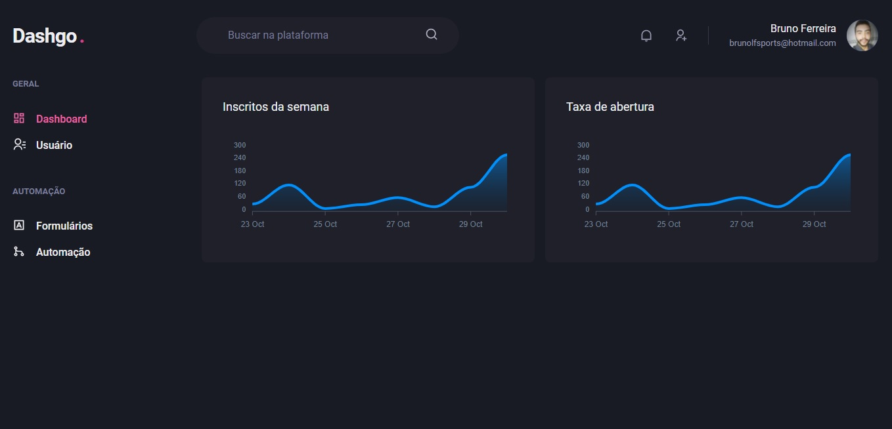

# DashGoD



Repositório criado com o objetivo de estudar a criação de 
Interface com o Chakra UI.

## Tecnólogias

✔ ReactJs - biblioteca Javascript
✔ NextJs - biblioteca de desenvolvimento web com renderização do servidor e geração de sites estáticos
✔ Chakra UI - biblioteca para criação de interfaces
✔ React Icons - biblioteca de Icones 
✔ Yup -Biblioteca de validação de formulários

## Instalação

Você precisará ter apenas o [NodeJS](https://nodejs.org) instalado na sua máquina, e após isso, clonar este repositório:
```sh
  $ git clone https://github.com/Bruno-Goudric/dashgo.git
```

Depois disso acesse a pasta do projeto que você deseja e instale as dependências executando o seguinte comando:
```sh
  $ yarn install  ou npm install
```

## Executando a aplicação

Execute o comando a baixo para inicializar a aplicação:
```sh
  $ yarn dev
```